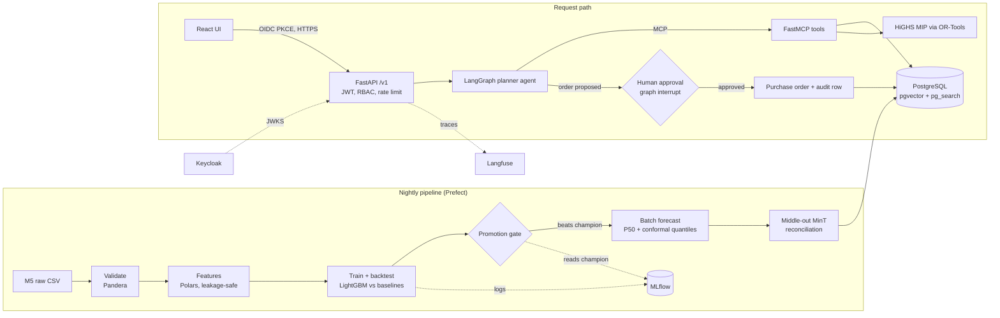

# Retail Demand & Inventory Decision Platform — Architecture

Status: v1.0 design, implemented in this repository
Owner: Akash Sharma

## 1. Problem

A grocery and general-merchandise retailer has to decide every week how many units of
each item to order for each store. Order too little and shelves go empty (lost sales,
unhappy customers). Order too much and cash sits on shelves as stock that has to be
stored, and some of it spoils or is marked down.

Planners today use a rule of thumb: "keep N days of average sales in stock". That rule
ignores seasonality, prices, events and uncertainty, and it ignores the constraints that
actually bind — the weekly purchasing budget, supplier minimum order quantities, case
packs and lead times.

The platform answers three questions for each store, every week:

1. **How much will each item sell over the next 28 days, and how uncertain is that?**
2. **What should we order today, given budget, MOQ, case packs and lead time?**
3. **Why?** — and let a planner question the plan, try what-if scenarios, and approve it.

## 2. Scope

| In scope | Out of scope (stated, not hidden) |
|---|---|
| Walmart M5 data, California: 4 stores × 3,049 items = **12,196 item-store series** | Other states, real supplier contracts |
| Daily forecasts, 28-day horizon, with P50 and upper quantiles | Promotions planning, price optimisation |
| Weekly replenishment with budget, MOQ, case packs, lead times | Multi-echelon (warehouse) inventory |
| 8-week inventory simulation against a rule-of-thumb policy | Real ERP integration |
| Planner assistant with human approval | Autonomous ordering without approval |
| API, UI, auth, audit, CI/CD, container deployment definition | Multi-region high availability |

**Data honesty.** M5 provides sales, prices and calendar events. It does not provide
suppliers, lead times, stock levels or costs. Those are generated deterministically
(seeded) from department and price, and the README says so. M5 sales are *observed*
sales, which understate demand when an item was out of stock; the simulator treats them
as demand, which is the standard simplification.

## 3. System overview



Two paths, deliberately separated:

- **Batch path** does everything expensive once a night: validation, training,
  backtesting, forecasting, reconciliation. Output is rows in PostgreSQL.
- **Request path** only reads those rows, runs one bounded optimisation, and lets the
  language model *explain* results. The model never produces a quantity.

## 4. Data layer

### 4.1 Sources
- `sales_train_evaluation.csv` — daily unit sales, d_1 … d_1941 (2011-01-29 → 2016-05-22)
- `calendar.csv` — dates, weekday, events, SNAP flags
- `sell_prices.csv` — weekly price per item-store

### 4.2 Ingestion and validation
1. Download once, cache in `data/raw/`, verify the file set.
2. Melt to long format for California stores only; store as partitioned Parquet.
3. **Pandera schemas** fail the pipeline on: negative sales, non-positive prices, unknown
   store or department IDs, gaps in the daily date sequence per series, duplicate keys.

### 4.3 Synthetic supply data (seeded, documented)
Per department: lead time (2–14 days), case pack (1–24), MOQ in units. Unit cost = 70% of
the item's median sell price. Holding cost = 25% of unit cost per year. Shortage cost =
margin lost per unit (30% of price).

## 5. Forecasting

### 5.1 Target and horizon
Daily unit sales per item-store, horizon 1–28 days, one global model for all series.

### 5.2 Features (leakage-safe by construction)
Every sales-derived feature is shifted by at least `min_lag` days relative to the target
date, so a model can forecast days 1…`min_lag` after a cut-off without recursion and
without leakage. Two feature sets are built: `min_lag = 14` (days 1–14, sees more recent
sales) and `min_lag = 28` (days 15–28).

- lags: min_lag, +7, +14, +21, +28 days, and 364 days
- rolling mean / std over 7, 28, 56 days, computed on sales shifted min_lag days
- same-weekday mean of the last four eligible weeks; item-level and store×department
  rolling demand
- price: current price, price relative to item's 52-week mean, week-on-week change
- calendar: weekday, day of month, week of year, month, event type, SNAP flag
- identifiers as categoricals: item, dept, cat, store

A dedicated test truncates history at several cut-offs and asserts every feature for dates
up to cut-off + min_lag is identical to the value computed on full history, for both
feature sets; a second test proves the check fails one day past the window.

### 5.3 Models
| Model | Role |
|---|---|
| Seasonal naive (same weekday last week, repeated) | Baseline every model must beat |
| TSB (Teunter-Syntetos-Babai) | Baseline for intermittent items |
| LightGBM, Tweedie objective, 28-day lags | Candidate |
| Two-stage LightGBM (14-day-lag model for days 1–14, 28-day-lag model for days 15–28) | Candidate |
| Two-stage LightGBM + middle-out MinT with an ETS blend at aggregate levels | Candidate (selected in v1.0) |
| Temporal Fusion Transformer (NeuralForecast) on store×department series, pushed to items | Deep-learning challenger |

The pipeline selects the candidate with the lowest mean WRMSSE across folds; nothing is
hand-picked. TFT runs in its own process because PyTorch and LightGBM each load an OpenMP
runtime, which can crash when both share a process on macOS.

### 5.4 Evaluation
- **Rolling-origin backtest:** 3 folds, each 28 days, non-overlapping, ending at d_1941.
- **Primary metric: WRMSSE** (official M5 metric) over the 12-level hierarchy restricted to
  California: total, store, category, department, store×category, store×department, item,
  item×store (state-level aggregates collapse into total).
- Secondary: WAPE, bias (%), and quantile coverage.
- Results note: scores cover the California subset and three folds, so they are not
  directly comparable with the M5 leaderboard, which scored all 10 stores on one period.

### 5.5 Uncertainty — Mondrian split conformal
The model gives a point forecast. Uncertainty comes from calibration residuals of the
most recent fold:

- series are bucketed by sales velocity (deciles of 28-day mean sales)
- for each bucket and each cumulative window length h = 1…28, compute empirical
  quantiles of `actual_cum − forecast_cum`
- upper quantile for service level α = forecast_cum + residual quantile(α)

This gives calibrated **cumulative** demand quantiles over lead time + review period,
which is exactly what replenishment needs (summing daily P90s would overstate it).
Coverage is checked on the held-out fold (target: within ±3 points of nominal).

### 5.6 Hierarchical coherence — middle-out MinT
Full MinT on 12k bottom series needs a covariance matrix too large for one machine.
The platform reconciles where it matters for budgets:

1. Aggregate item forecasts to store × department (28 series) and build the hierarchy
   store-dept → store / category / dept / store×category → total (55 nodes).
2. Base forecast per node = 50% AutoETS (sees sales up to the cut-off) + 50% summed
   LightGBM. Reconcile with **MinT-shrink** using ETS in-sample residuals.
3. Push the reconciled store-dept totals back down to items in proportion to item
   forecasts.

Result: item forecasts add up exactly to reconciled department, store and total numbers.

### 5.7 Model lifecycle
- Every run logs parameters, data hash, metrics, backtest table and feature importance
  to **MLflow**.
- **Promotion gate:** a candidate becomes `champion` only if its WRMSSE beats the current
  champion (or, on first run, beats seasonal naive by ≥ 10%) *and* conformal coverage is
  within band. Otherwise the pipeline keeps the old champion and fails loudly.
- **Drift:** a Population Stability Index report (`pipeline/drift.py`) compares the latest
  28 days of key features with the training window (PSI < 0.1 stable, 0.1–0.25 moderate,
  > 0.25 significant). Drift is reported in `artifacts/reports/drift.json`, not auto-acted on.

## 6. Replenishment

### 6.1 Policy
Periodic review, R = 7 days. At each review for item i in store s:

```
target_i   = conformal_upper(cum demand over L_i + R, service level)
position_i = on_hand_i + on_order_i
need_i     = max(0, target_i − position_i)
```

### 6.2 Optimisation — mixed-integer program (HiGHS via OR-Tools), one model per store per review
Decision: `packs_i ∈ ℤ≥0`, `order_i ∈ {0,1}`

- `units_i = packs_i × case_pack_i`
- MOQ: `units_i ≥ MOQ_i × order_i`, `packs_i ≤ ub_i × order_i`
- Budget: `Σ units_i × unit_cost_i ≤ weekly_budget_s`
- Shelf capacity: `units_i + position_i ≤ capacity_i`
- Objective (integer cents): minimise
  `Σ shortage_cost_i × max(0, need_i − units_i) + holding_cost_i × max(0, units_i − need_i)`

Solver limits: 0.1% optimality gap, 20 s safety limit. Returns status, objective and proven gap; an
infeasible or timed-out solve falls back to the best feasible solution and is flagged.

### 6.3 Simulation
Replay the last **8 weeks** of actual M5 sales day by day for all 12,196 series under two
policies, from identical starting stock:

| Policy | Rule |
|---|---|
| Baseline (rule of thumb) | When position < (L + 7) days of 28-day mean sales, order up to (L + R + 7) days, rounded up to case packs |
| Platform | Conformal target + HiGHS order optimisation with budget, MOQ, case packs, shelf capacity |

Mechanics: orders arrive after lead time; unmet demand is lost. Reported: fill rate,
stockout item-days, lost sales ($), average inventory value ($), holding cost ($),
budget violations (must be 0 for the platform).

## 7. Planner assistant

### 7.1 Tools (FastMCP server, allowlisted, Pydantic-typed)
| Tool | Access |
|---|---|
| `get_forecast(item_id, store_id, days)` | read |
| `get_inventory_position(item_id, store_id)` | read |
| `plan_replenishment(store_id, budget)` | computes draft plan |
| `what_if(store_id, demand_change_pct, lead_time_change_days)` | computes on a copy |
| `search_policy(query)` | read |
| `submit_order(plan_id)` | write — always behind approval |

### 7.2 Graph (LangGraph)
```
route ──► lookup tools ─────────────► explain ──► guard ──► respond
  │                                      ▲
  └─► plan / what-if tools ──────────────┘
                     │
                     └─► propose order ──► interrupt (approver) ──► submit_order ──► audit
```

- **Router** is rule-based first (entity + intent patterns). Only ambiguous requests go
  to the LLM router. Pure lookups never call an LLM.
- **Explainer** uses GPT-4o mini when `OPENAI_API_KEY` is set; otherwise an offline
  template explainer produces the same structured answer. The mode is shown in the
  response.
- **Numeric faithfulness guard:** every number in the answer must appear in, or be
  derivable by rounding from, the tool outputs of that request. Otherwise the answer is
  replaced by the tool data table.
- **Limits:** ≤ 6 graph steps, ≤ 800 output tokens, 20 s timeout.
- **Approval:** `submit_order` runs only after a LangGraph interrupt resumed by a user with
  the `approver` role who did not create the plan.

### 7.3 Policy retrieval
- 10 purchasing-policy documents in `knowledge/policies/`, chunked by heading.
- Dense: **BGE-M3** embeddings in **pgvector** (HNSW, cosine).
- Sparse: **pg_search BM25** (ParadeDB).
- Fusion: reciprocal rank fusion (k = 60) over top 30 from each.
- Rerank: **BGE Reranker v2 M3** on fused top 30 → top 5 to the explainer.
- Cache: Redis, key = hash(normalised query), TTL 24 h.
- Retrieved text is passed as quoted, untrusted data. A planted prompt-injection document
  is part of the eval set.
- An in-process backend (NumPy + BM25) implements the same interface for tests and
  offline evaluation.

## 8. API

FastAPI, versioned under `/v1`, Pydantic v2 models, OpenAPI docs.

| Method & path | Role |
|---|---|
| `GET /v1/stores` | viewer |
| `GET /v1/forecasts/{store_id}/{item_id}` | viewer |
| `GET /v1/backtest/summary` | viewer |
| `POST /v1/plans` (store, budget) | planner |
| `GET /v1/plans/{plan_id}` | viewer |
| `POST /v1/plans/{plan_id}/approve` | approver, not plan creator |
| `POST /v1/assistant/chat` | planner |
| `GET /healthz`, `GET /readyz` | public |

## 9. Security

| Area | Control |
|---|---|
| Authentication | Keycloak OIDC; React uses authorisation code + PKCE; API verifies RS256 signature via JWKS, issuer, audience, expiry |
| Authorisation | Roles `viewer` < `planner` < `approver` < `admin`; separation of duties on approval |
| Secrets | Environment injected at runtime (Vault / AWS Secrets Manager in deployment); `.env` never committed; gitleaks in pre-commit and CI |
| Database | Separate `app_read` / `app_write` roles; SQLAlchemy parameterised queries; DB not exposed outside the container network |
| LLM | Tool allowlist, typed arguments, approval before writes, untrusted retrieval context, numeric guard, step/token/time limits |
| API | Rate limiting, CORS allowlist, request body size limit, security headers and TLS at Caddy |
| Supply chain | Locked dependencies (`uv.lock`), pip-audit, Bandit, Trivy image scan, Dependabot |
| Containers | Multi-stage builds, non-root user, read-only root filesystem where possible |
| Audit | Append-only `audit_log`: actor, action, entity, before/after, request id, timestamp |

## 10. Observability

- Structured JSON logs with request id.
- Langfuse traces (enabled when keys are set): one trace per assistant request with nested
  tool calls, policy retrieval (cache hit or miss) and the LLM generation with token usage.
- `/metrics` Prometheus endpoint: HTTP latency and errors, optimiser solve time, retrieval
  cache hits/misses and time, LLM tokens and latency, assistant latency by intent, guard outcomes.
- Conversation state (pending approvals) is checkpointed in PostgreSQL, so it survives restarts.
- Load test: Locust scenario for forecast reads and chat; p50/p95 reported in README.

## 11. Delivery

### 11.1 Repository layout
```
src/retail_platform/
  config.py            settings (pydantic-settings)
  data/                download, load, schemas, supply data
  features/            leakage-safe feature builder
  forecast/            baselines, lightgbm, tft, backtest, wrmsse, conformal, reconcile
  inventory/           policy, optimiser, simulator
  pipeline/            prefect flows, promotion gate, drift
  storage/             SQLAlchemy models, repositories, migrations
  api/                 FastAPI app, auth, rbac, routes, audit
  rag/                 chunking, embedders, hybrid search, reranker, cache
  agent/               router, explainer, guard, LangGraph graph
  mcp/                 FastMCP tool server
knowledge/policies/    purchasing policy documents
evals/                 retrieval & agent golden sets and runners
tests/                 unit, API, optimiser constraints, leakage, security
web/                   React + Vite + TypeScript
infra/                 docker compose, Caddy, Keycloak realm, AWS deploy
.github/workflows/     ci.yml, deploy.yml
```

### 11.2 Quality gates (CI)
ruff → mypy → pytest (unit + API + constraint + leakage) → agent/retrieval evals →
pip-audit + Bandit → Docker build → Trivy.

### 11.3 Deployment target
Single AWS EC2 host running Docker Compose behind Caddy (automatic TLS): api, worker,
PostgreSQL (ParadeDB), Redis, Keycloak, MLflow; MLflow artefacts and nightly `pg_dump`
in S3. GitHub Actions deploys via OIDC-assumed role and SSM Run Command — no SSH keys,
no long-lived AWS credentials. Security group exposes 443 only.

## 12. Architecture decisions

| # | Decision | Why |
|---|---|---|
| ADR-001 | LightGBM production model, TFT challenger | Top M5 solutions were gradient-boosted; trains in minutes; TFT must win on WRMSSE to be promoted (it did not: 0.583 vs 0.574) |
| ADR-002 | Direct models with lags ≥ horizon (two stages: 14 and 28 days) | No recursion error accumulation, no leakage, one model for all horizons |
| ADR-003 | Conformal cumulative quantiles | Coverage can be checked; cumulative demand over lead time is what ordering needs |
| ADR-004 | Middle-out MinT | Coherent budgets without a 12k × 12k covariance |
| ADR-005 | Mixed-integer program solved with HiGHS (OR-Tools) | Case packs and MOQs are integer constraints that heuristics silently violate. Benchmarked on real store plans: CP-SAT hit its 10 s limit when budgets bound and gave load-dependent plans; HiGHS proves optimality in under 1 s and is deterministic |
| ADR-006 | Batch forecasts, online optimisation | Forecasts change daily; plans must react to budget and what-ifs instantly |
| ADR-007 | LLM explains, never computes | Every quantity is reproducible and auditable |
| ADR-008 | One PostgreSQL for app data, vectors and BM25 | One system to secure, back up and operate |
